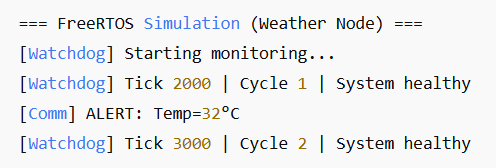

# 🌤️ FreeRTOS Simulated Weather Node

[](https://en.cppreference.com/w/c)  
[](https://www.freertos.org/)  
[](LICENSE)  

A simulated weather node using **FreeRTOS** for Windows.  
It includes tasks for sensors, processing, communication, and a watchdog, fully simulated on PC without hardware.

---

## 🌟 Features
- Simulated temperature/humidity sensor task  
- Processing and communication tasks  
- Watchdog task monitoring system health  
- Fully PC-simulated using FreeRTOS on Windows  
- Easy to compile with CMake + MSYS2/MinGW  

---

## 🎬 Demo


*Example workflow of the app*  

---

## 🛠️ Installation

### 1️⃣ Clone the repository
```bash
git clone https://github.com/USERNAME/FreeRTOS_Simulated_Weather.git
cd FreeRTOS_Simulated_Weather

# Mac/Linux
source venv/bin/activate